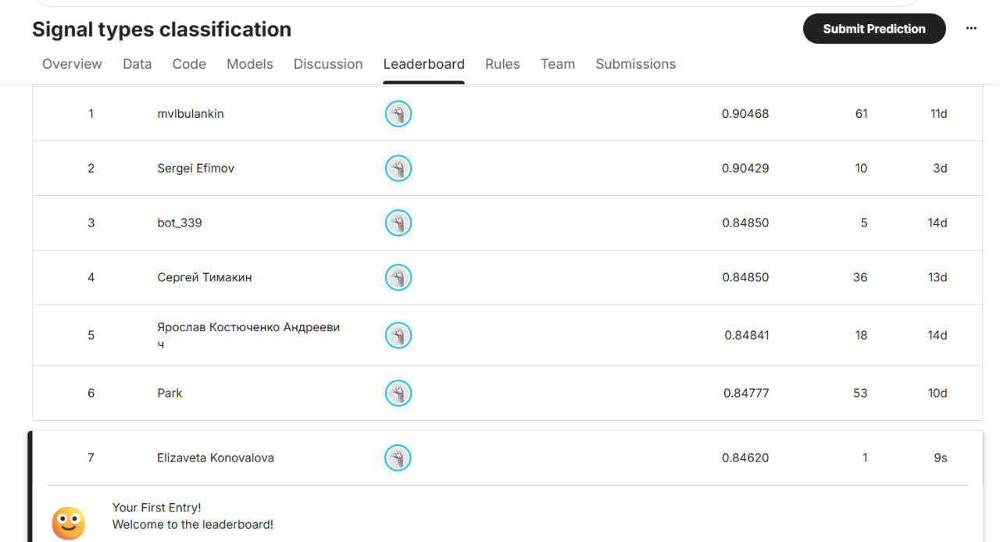

# Кластеризация сигналов сцинтилляционного детектора

Проект посвящен автоматической кластеризации сигналов, полученных со сцинтилляционного детектора. Необходимо разделить зарегистрированные импульсы на группы по форме сигнала: два основных кластера интерпретируются как сигналы от гамма-квантов и нейтронов, а третий должен соответствовать аномальным, шумовым или трудноидентифицируемым сигналам.

Основная работа находится в ноутбуке `final.ipynb`. Ноутбук `baseline_2_clusters.ipynb` содержит базовое решение с разделением сигналов на два кластера.

## Краткое описание проекта

| Параметр | Значение |
|:---------|:---------|
| **Тип задачи** | Обучение без учителя, кластеризация |
| **Цель** | Разделить 23 479 сигналов сцинтилляционного детектора на 3 кластера |
| **Объекты** | Временные формы сигналов длиной 500 отсчетов АЦП |
| **Основной подход** | Предобработка сигнала, feature engineering, UMAP, KMeans |
| **Лучшая модель** | KMeans на UMAP-проекции нормализованных и инженерных признаков |
| **Метрика** | Accuracy на Kaggle leaderboard |
| **Лучший результат** | **0.84620** для разделения на 2 основных кластера |
| **Финальный выбор для 3-го кластера** | Goodness-of-fit как наиболее физически интерпретируемый метод |

## Цель проекта

Построить алгоритм, который без размеченных данных группирует сигналы сцинтилляционного детектора по их форме.

Физическая идея решения основана на Pulse Shape Discrimination (PSD): гамма-кванты и нейтроны по-разному возбуждают сцинтиллятор, поэтому их импульсы отличаются характером затухания. У гамма-квантов спад обычно быстрее, а у нейтронов хвостовая часть выражена сильнее.

Дополнительно в задаче требуется выделить третий кластер сигналов, которые не относятся уверенно ни к одному из двух основных типов.

## Структура репозитория

```text
.
+-- data/
|   `-- Run200_Wave_0_1.txt
+-- screen/
|   `-- kaggle_leaderboard.jpg
+-- baseline_2_clusters.ipynb
+-- final.ipynb
+-- pyproject.toml
`-- README.md
```

## Данные

Исходные данные находятся в файле:

```text
data/Run200_Wave_0_1.txt
```

Каждая строка соответствует одному зарегистрированному сигналу. В ноутбуке после удаления служебных столбцов остается матрица размера:

```text
23479 x 500
```

То есть каждый объект описывается временной формой сигнала длиной 500 отсчетов АЦП.

## Ход работы

В ноутбуке `final.ipynb` выполнен полный исследовательский цикл:

1. Загрузка и первичная проверка данных.
2. Визуализация временных форм сигналов.
3. Анализ максимальных амплитуд и вариативности сигналов.
4. Расчет PSD-признака для оценки вклада хвостовой части импульса.
5. Анализ зависимости амплитуды от площади под сигналом.
6. Предобработка: инверсия сигнала, вычитание baseline и нормализация по максимальной амплитуде.
7. Формирование признаков: PSD, стандартное отклонение, эксцесс, FWHM и участок сигнала около пика.
8. Стандартизация признаков и снижение размерности через UMAP.
9. Кластеризация основных типов сигналов с помощью KMeans.
10. Проверка нескольких гипотез для выделения третьего кластера.
11. Сравнение дополнительных моделей и итоговая интерпретация результата.


## Модели и эксперименты

Базовая модель проекта - `KMeans` на двумерной UMAP-проекции. Она разделяет данные на два физически осмысленных кластера:

- кластер с более длинным хвостом интерпретируется как нейтроны;
- кластер с более быстрым спадом интерпретируется как гамма-кванты.

Для поиска третьего кластера были проверены несколько гипотез:

- слабые или шумовые сигналы по порогу максимальной амплитуды;
- 1% самых слабых импульсов;
- аномалии, найденные `IsolationForest`;
- переходные сигналы на границе двух кластеров через ближайших соседей;
- сигналы, плохо совпадающие с шаблонами гамма-кванта и нейтрона, через goodness-of-fit.

Также дополнительно рассматривались `DBSCAN` и `GaussianMixture`.

## Метрики

Лучший результат на Kaggle leaderboard для двух основных кластеров был получен с помощью `KMeans`:

```text
Accuracy = 0.84620
```

Попытки выделить третий кластер не улучшили качество на лидерборде

Скриншот результата на leaderboard:



## Выводы

Сигналы удалось надежно разделить на два физически обоснованных кластера, соответствующих разным типам частиц. Наиболее полезными оказались признаки, описывающие хвостовую часть импульса: PSD, FWHM, эксцесс и нормализованный участок формы сигнала около пика.

Третий кластер оказался более сложным: протестированные способы его выделения не дали прироста качества. Наиболее физически обоснованным выбран метод goodness-of-fit, так как он выделяет сигналы, хуже всего совпадающие с усредненными шаблонами двух основных типов и имеющие более рваную форму.

Основное направление для дальнейшего улучшения - глубже исследовать природу третьего кластера и попробовать построить более устойчивые шаблоны основных классов, чтобы уменьшить влияние шумных меток KMeans.

## Как запустить проект

Проект использует `uv` для управления зависимостями и виртуальным окружением.

### 1. Установить uv

Если `uv` еще не установлен, его можно установить через PowerShell:

```powershell
pip install uv
```

### 2. Установить зависимости

Из корня проекта выполните:

```powershell
uv sync
```

### 3. Запустить JupyterLab

```powershell
uv run jupyter lab
```

После запуска откройте основной ноутбук:

```text
final.ipynb
```

Для просмотра базового решения откройте:

```text
baseline_2_clusters.ipynb
```
